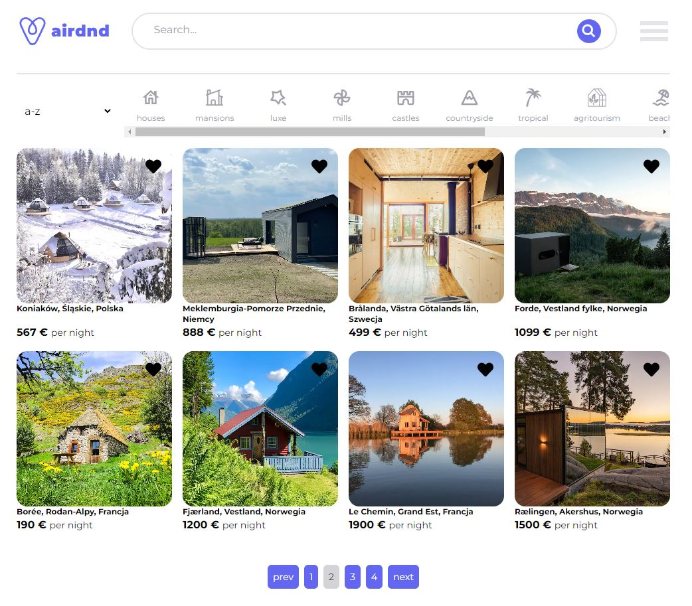

## Airbnb clone 

The application was written in the React with Typescript.
Other technologies used in the project:
- TailwindCSS
- React Hook Form + yup validation
- Tanstack Query

REST API was written in Nodejs using the express framework. 
The database is MongoDB Atlas.

